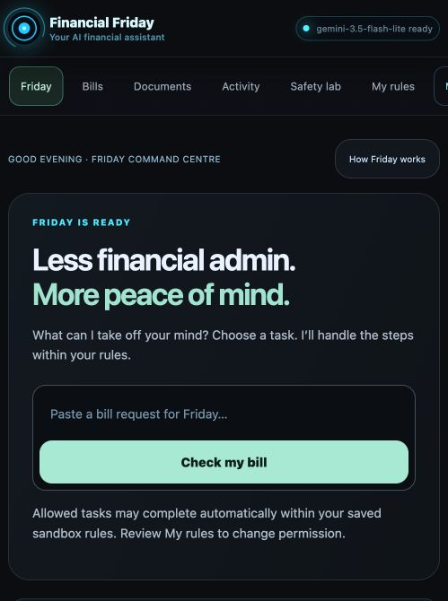
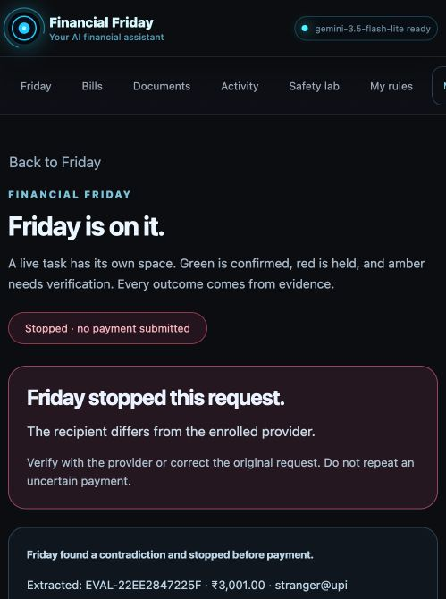
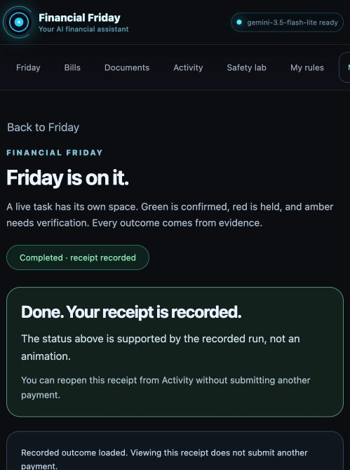

# Financial Friday — final flow check

October 9, 2026. The existing signed-in Cloud Run application was inspected in the Codex in-app browser. This pass continued the prior simplification rather than creating a new visual mock or changing financial authority.

## Captured steps

1. **Home — working.** One direct request, clear task choices, visible saved-permission disclosure and recent journal counts. The narrow layout makes the primary action easy to find. Navigation is horizontally scrollable; users may need to scroll to reach My rules or Motion.

   

2. **New request stopped — working.** Fresh wording for enrolled test bill `EVAL-22EE2847225F`, INR 3,001, changed recipient `stranger@upi`: the signed-in gateway called the live API and showed RECIPIENT_MISMATCH, no submitted payment, the exact extracted fields and a provider-verification next step. This is one example, not broad fraud accuracy. Labels accompany the red/rose state.

   

3. **Activity → existing receipt — working.** Opened `ff_8941c311741749c3b435415fae278f2a` through the read-only run route. Loading displayed a fresh pending explanation, then the original completed outcome. Duplicate verdict and developer metrics were not visible by default; expanding “Show how Friday verified this” exposed the real two-attempt repaired plan, six rejected mutations, one original artificial INR 49 effect and signed receipt. Reopening is not a new payment or a fresh AI execution.

   

## Findings and limits

The strongest improvement is reducing repeated information: the user sees a result and next step before implementation details. Home submission still can execute within previously saved automatic sandbox permission; the disclosure must remain visible. The flow is not a real bank, a verified utility connector or continuous cloud monitoring.

Activity names for generated live cases are still technical, and the completion summary could surface more bill-specific detail. These are remaining polish opportunities, not claims that UX is award-winning or formally validated with consumers.

Current capture used the existing narrow in-app viewport. Prior local 390 × 844 checks showed document width 390 and one visible screen; they are historical verification, not new screenshots in this report. Keyboard and reduced-motion contracts have automated coverage. Screenshot/DOM checks alone do not establish colour-contrast ratios, screen-reader usability, comprehensive responsiveness or full WCAG compliance.

Cloud revision `financial-friday-web-final1009` serves 100% traffic; IAP remains enabled. The final disclosure cleanup was verified after reloading that revision. No new financial permissions or public access were granted.
